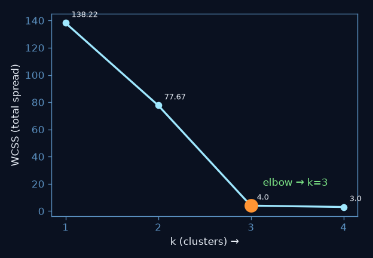
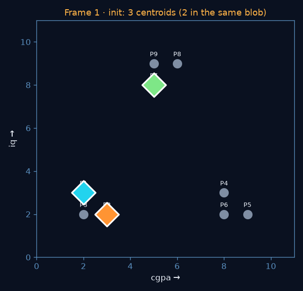
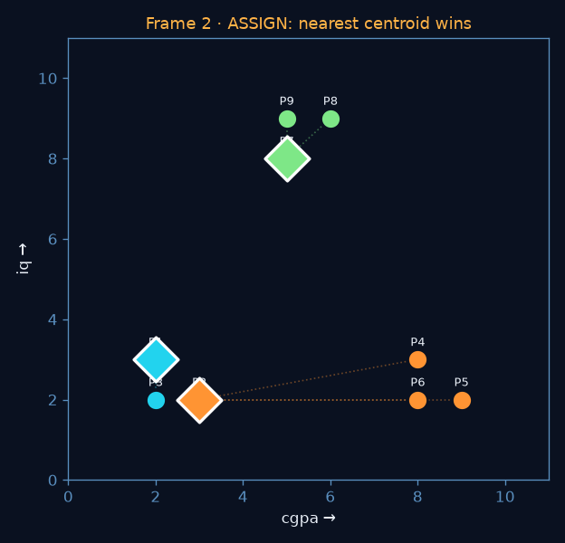
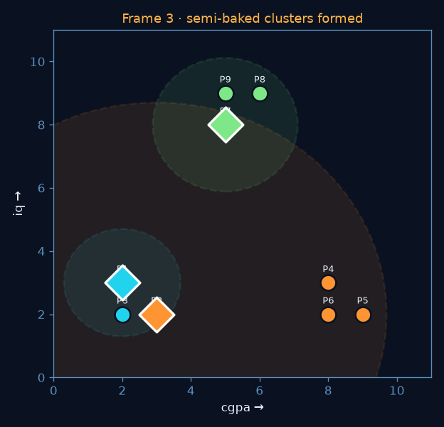
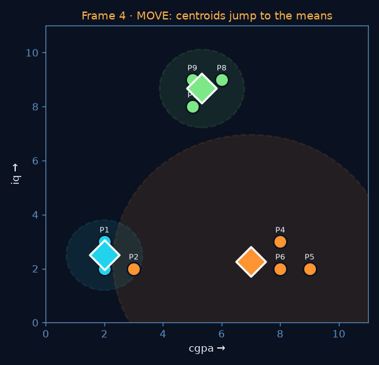
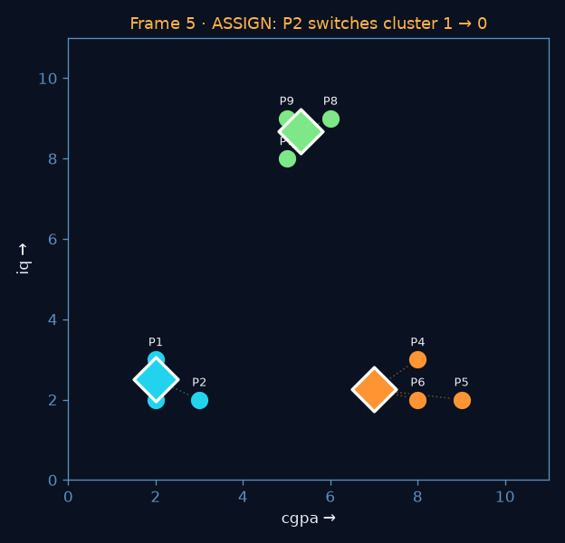
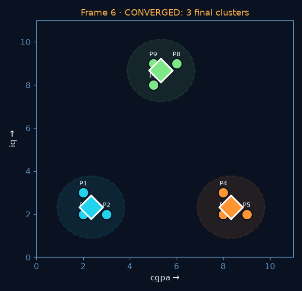

# K-means clustering

> **Recap:** **K-means DISCOVERS groups when there are no labels — pick k by the elbow, then loop
> assign→mean until the centroids stop moving.** It *clusters* (finds the bins); it does not
> *classify* (sort into bins you already have).

**Chain:** [[vectors]] (Euclidean distance) ──► **k-means** ──► wear-level / health-tier grouping ──► on-device anomaly triage ([[thermal-project]])
**Chain:** [[pca]] ──► compress 20→3 ──► **k-means** (cluster in the small space where distance still means something)

## What it is (plain words)

You have data and **no labels.** K-means drops `k` flags (centroids), lets every point join its
nearest flag, then slides each flag to the middle of its crowd — and repeats until nothing moves.
The groups fall out on their own; **you name them afterward.** Same "loop until it settles" rhythm
as [[gradient-descent]], different job (grouping, not fitting a line).

## The frame-by-frame walk (the anchor)  ^anchor

Dataset: 9 students, features **cgpa (x)** and **iq (y)**, no labels.
`P1(2,3) P2(3,2) P3(2,2) · P4(8,3) P5(9,2) P6(8,2) · P7(5,8) P8(6,9) P9(5,9)`
Cluster colours throughout: **cluster 0 = cyan · cluster 1 = orange · cluster 2 = green** · ◆ = centroid.

### Part A — how many clusters? (the elbow)

Run k-means for each k and record **WCSS** (within-cluster sum of squares — total spread of points
from their own centroid). WCSS always falls as k rises, so you look for the **corner**:

```
k = 1 → WCSS = 138.22     (one clump, hopeless)
k = 2 → WCSS =  77.67     (big drop — real structure)
k = 3 → WCSS =   4.00     ← steep drop, THEN it flattens = the elbow
k = 4 → WCSS ≈   3.0      (barely helps)
```



🪤 Do **not** just pick the lowest WCSS: at `k = 9` every point is its own centroid → WCSS = 0 →
useless. The elbow is `k = 3`. ![[trap-log#^kmeans-wcss-min]]

### Part B — watch k = 3 run from scratch

**Frame 1 — init.** Pick 3 real points as starting centroids, deliberately clumsy (two seeds land
in the *same* blob) to prove it self-corrects: `c0=P1(2,3) · c1=P2(3,2) · c2=P7(5,8)`.



**Frame 2 — ASSIGN (iter 1).** Each point joins its nearest centroid by **Euclidean distance**:

```
P1(2,3): d0=0.00  d1=1.41  d2=5.83 → cluster 0
P2(3,2): d0=1.41  d1=0.00  d2=6.32 → cluster 1
P4(8,3): d0=6.00  d1=5.10  d2=5.83 → cluster 1
P7(5,8): d0=5.83  d1=6.32  d2=0.00 → cluster 2
→ c0:{P1,P3}  c1:{P2,P4,P5,P6}  c2:{P7,P8,P9}   WCSS = 91.0 (messy: c1 grabbed the whole right blob + P2)
```



**Frame 3 — semi-baked clusters.** Those assignments carve out three rough groups (circle each):



**Frame 4 — MOVE (iter 1).** Each centroid slides to the **mean** of its members:

```
c0 = mean(P1,P3)          = (2, 2.5)
c1 = mean(P2,P4,P5,P6)    = (7, 2.25)
c2 = mean(P7,P8,P9)       = (5.33, 8.67)
```



**Frame 5 — ASSIGN (iter 2): a point switches.** Re-measuring to the moved centroids, `P2` is now
closer to `c0` than `c1` → **P2 jumps cluster 1 → 0**:

```
P2(3,2): d0=1.12  d1=4.01  → cluster 0   ← the switch
→ c0:{P1,P2,P3}  c1:{P4,P5,P6}  c2:{P7,P8,P9}   WCSS = 9.77 (big drop!)
```



**Frame 6 — MOVE (iter 2) → CONVERGED.** New means = `c0(2.33,2.33) · c1(8.33,2.33) · c2(5.33,8.67)`.
Re-assign (iter 3): nothing switches → next move moves nothing → **stop**. Final **WCSS = 4.00**,
matching the elbow.



```
Final: cluster 0 (2.33,2.33) P1 P2 P3 — low cgpa, low iq
       cluster 1 (8.33,2.33) P4 P5 P6 — high cgpa, low iq
       cluster 2 (5.33,8.67) P7 P8 P9 — mid cgpa, high iq
```

## Numpy twin

```python
import numpy as np
P = np.array([[2,3],[3,2],[2,2],[8,3],[9,2],[8,2],[5,8],[6,9],[5,9]], float)
C = P[[0,1,6]].copy()                                   # clumsy init: P1, P2, P7
for _ in range(10):
    lab = np.array([np.argmin(((p-C)**2).sum(1)) for p in P])   # ASSIGN: nearest centroid
    newC = np.array([P[lab==k].mean(0) for k in range(3)])       # MOVE: mean of members
    if np.allclose(newC, C): break                               # converged when centroids freeze
    C = newC
wcss = sum(((P[i]-C[lab[i]])**2).sum() for i in range(9))
print(np.round(C,2))     # [[2.33 2.33] [8.33 2.33] [5.33 8.67]]
print(round(wcss,2))     # 4.0   ← matches the elbow's k=3
```

## Where it came from / where it goes

builds-on:: [[vectors]] — a cluster is "points close in feature space"; closeness = Euclidean distance `√Σ(pᵢ−cᵢ)²`
builds-on:: [[variance-sigma]] — WCSS is the summed within-cluster variance; k-means literally minimizes empirical variance inside each group
builds-on:: [[mean]] — the MOVE step sets each centroid = the mean of its members (that's the whole update)
builds-on:: [[pca]] — often compress first (20→3) so distance stays meaningful before clustering (curse of dimensionality)
contrasts-with:: [[ml-taxonomy]] — a classifier sorts into KNOWN labels (supervised); k-means DISCOVERS groups with no labels (unsupervised)
contrasts-with:: [[gradient-descent]] — same "iterate to convergence" rhythm and same local-minima risk, but it alternates assign/mean instead of following a gradient
feeds:: [[thermal-project]] — group blocks/drives into wear or health tiers with no hand labels
project-brick:: [[thermal-project]] — unsupervised health-tier grouping over telemetry (R1-adjacent, feature space from [[pca]])
scroll:: [[2026-07-18_kmeans-clustering-walkthrough_s5]]
twin-page:: [K-means walkthrough (elbow + the loop)](../html/2026-07-18_kmeans-clustering-walkthrough_s5.html)
video:: [StatQuest — K-means](https://www.youtube.com/watch?v=4b5d3muPQmA)

## Decision boundary

- ✅ Unlabelled data, and you want to **discover** natural groups (health tiers, wear families, customer segments).
- ✅ Groups are roughly round, similar-size blobs in a space where Euclidean distance is meaningful.
- ❌ **When it burns you:** you actually have labels → use a classifier, not clustering. Non-spherical/varying-density clusters → k-means splits them wrong (use DBSCAN/GMM). Un-scaled features → the big-range feature hijacks the distance (scale first). High-dimensional raw data → distances flatten (PCA first).
- ❌ It **clusters, never classifies** — the groups are nameless until you inspect them. ![[trap-log#^kmeans-classify]]

## Traps I hit

![[trap-log#^kmeans-classify]]
![[trap-log#^kmeans-wcss-min]]

## Depth layers

- **2026-07-18 (s5, first contact):** full algorithm rebuilt from the StatQuest video + lecture — elbow to pick k, clumsy init, assign-by-nearest, mean update, the P2 switch, convergence, and the local-minima restart. Frame-by-frame anchor above. → [[2026-07-18_kmeans-clustering-walkthrough_s5]]

## Project brick

**Unsupervised health-tier grouping:** cluster drives/blocks by their telemetry signature (fresh /
mild-wear / dying) with **no hand labels** — the discovery step that can seed labels for the
supervised throttle model later. Runs in the compressed feature space from [[pca]].

## Formula

```
1. pick k (elbow: plot WCSS vs k, take the corner)
2. init k centroids (random data points; re-run several times, keep lowest WCSS)
repeat:
   ASSIGN  cᵢ = argmin_k ‖xᵢ − μ_k‖²        (each point → nearest centroid, Euclidean)
   MOVE    μ_k = mean of points assigned to k
until assignments stop changing (centroids freeze)

objective  WCSS = Σ_k Σ_{i∈k} ‖xᵢ − μ_k‖²    (total within-cluster spread — minimized)
```

## Flashcards

#flashcards/kmeans

Decision tree vs k-means — both organise data by features. What's the ONE-word difference? :: Tree CLASSIFIES (sorts into known labels); k-means CLUSTERS (discovers groups that had no labels).
On the elbow plot, why not just pick the k with the lowest WCSS? :: WCSS always drops with k and hits 0 at k=n (every point its own cluster = useless). Pick the elbow, where the drop stops paying off.
What are the two alternating steps of the k-means loop, and when does it stop? :: ASSIGN each point to its nearest centroid, then MOVE each centroid to its cluster's mean. Stop when assignments (centroids) stop changing.
Why re-run k-means several times with different initial centroids? :: A bad init can trap it in a local minimum (a worse clustering). Re-run and keep the result with the lowest WCSS.
